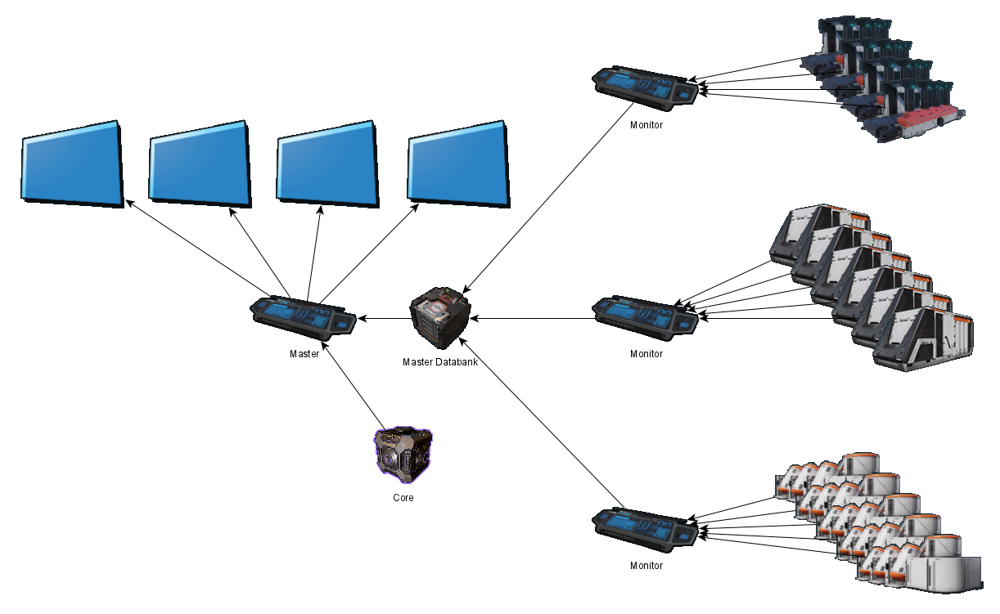
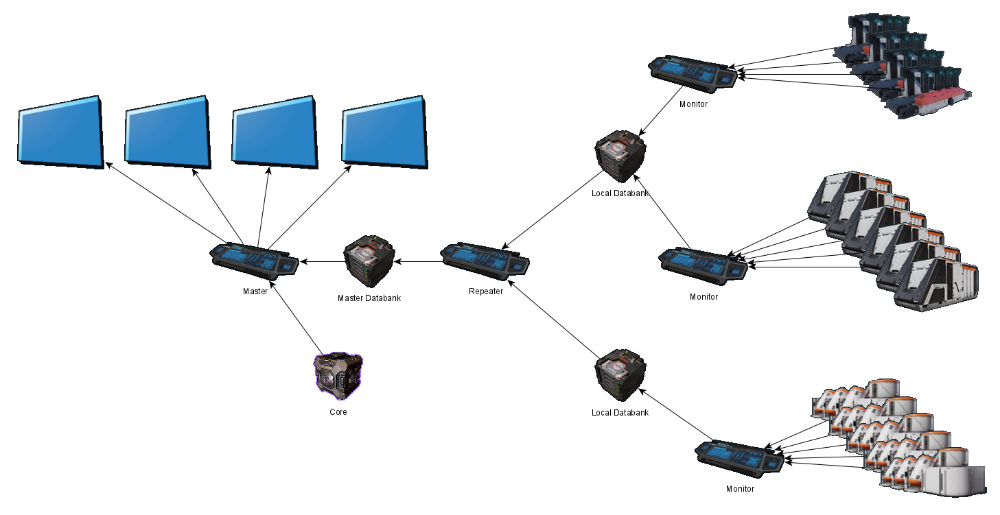

# InDUstrious
Screens for a Dual Universe Industrial Control Room, by Smacker: 
###### In game: Smacker, Discord: Smacker#5268
Discord Channel: https://discord.gg/Gw5HWJhXFR

 

### Introduction
Screen based factory monitor, simulating a real control room
* Can monitor container contents if they have a single item
* Can designate containers as overflows
* Can monitor industry unit states and display any issues (like being jammed)
  * Will not clutter the display with units that are in a normal state (running, pending, stopped etc)
* Supports US spellings

### Notes
* Industry units running normally are not shown
* Restart the master board if you rename anything
* Sometimes displays show as blank grey screens, restart the game to fix this

Wiki has FAQ: https://github.com/SamMackrill/InDUstrious/wiki 

## Installation
* Name the containers (including hubs) as C_XXXX where XXXX is the name of what is being stored e.g. C_Bauxite
  * If you have multiple containers and hubs with the same content then name them all the same
* Name the overflow containers (including hubs) as O_XXXX where XXXX is the name of what is being stored e.g. O_Hydrogen
* Some substance names cannot be matched exactly as NQ forbid certain characters in custom names (see below for list)
* Add 4 large/medium screens, 2 x 2 layout of large screens seems best
* Rename the screens (not the slots) exactly:
  * ContDisplay1, ContDisplay2, ContDisplay3 etc
  * ProdDisplay1, ProdDisplay2, ProdDisplay3 etc
  * You can have as many screeens as you have spare slots on the master board
  * To mirror a display connect a screen with the same name e.g. add onothe screen called ContDisplay1

### Installation - Simple
#### How it works

#### Master Only
* Add a databank
* Add a programming board
* Connect the core and databank and screens to the programming board (any order, do not rename any of the slots)
* Paste the master config into the programming board
* Add up to 9 monitor programming boards
* Connect up to 9 industries and the databank to the monitor programming board (any order, do not rename any of the slots)
* Paste the monitor config into all the monitor programming boards

### Installation - Expanded
#### How it works

#### Master
* Add a master databank
* Add a master programming board
* Connect the core, master databank and screens to the master programming board (any order, do not rename the slots)
* Paste the master config into the master programming board
#### Remote Monitor(s)
* Add a remote databank
* Add upto 9 programming boards
* Connect up to 9 industries and the databank to each remote monitor programming board (any order, do not rename the slots)
* Paste the monitor config into all the remote monitor programming boards
#### Repeater(s)
* Add a repeater programming board
* Connect the repeater programming board to upto 9 remote databanks and the master databank (any order, do not rename the slots)
* Paste the repeater config into the repeater programming board

### Installation - Optional
* Name the industry machines after what they are producing
* Add a button and relays to turn eveything on at once
* Tweak the behaviour by right clicking the master programming board -> Advanced -> Edit Lua Parameters

## Substance name list

_ | _ | _ | _ | _ | _ | _ | _
-- | -- | -- | -- | -- | -- | -- | --
Acanthite | AlFe | AlLi | Aluminium | Bauxite | Calcium | Carbon | CaRefCu
Chromite | Chromium | Coal | Cobalt | Cobaltite | Columbite | Copper | Cryolite
CuAg | Duralumin | Fluorine | Fluoropolymer | Garnierite | Gold | GoldNuggets | Hematite
Hydrogen | Illmenite | Iron | Kolbeckite | Limestone | Lithium | Malachite | Manganese
Natron | Nickel | Niobium | Oxygen | Petalite | Polycalcite | Polycarbonate | Polysulfide
Pyrite | Quartz | Rhodonite | Scandium | Silicon | Silumin | Silver | Sodium
Stainless steel | Steel | Sulfur | Titanium | Vanadinite | Vanadium

## Credits
* badman74 for initial approach: https://github.com/badman74/DU
* DU Open Source Initiative
