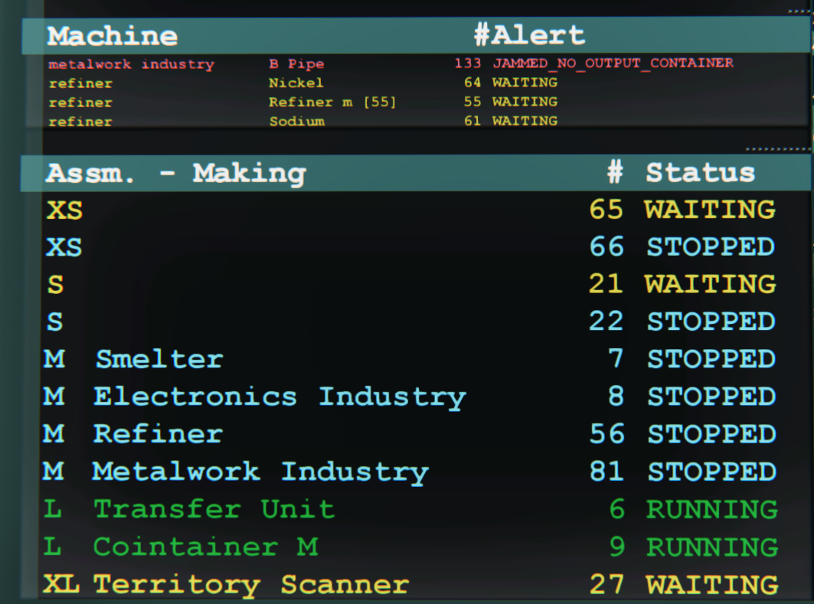
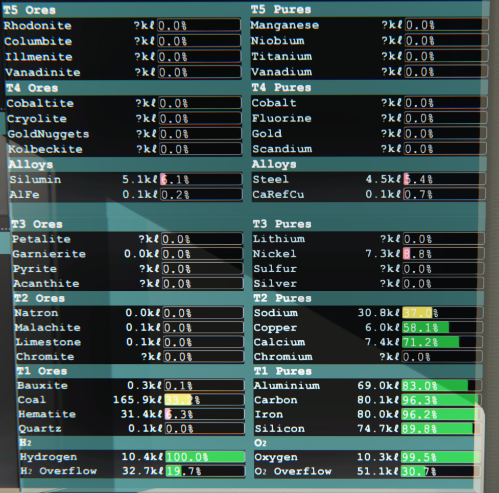
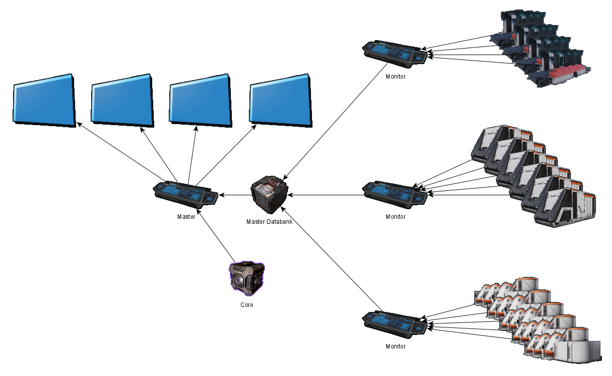

# InDUstrious
Screens for a Dual Universe Industrial Control Room

 

### Introduction
Screen based factory monitor, simulating a real control room
Can monitor contaner contents if they have a single item
Can designate continers as overflows
Can monitor industry unit states and any issues

### How it works - Simple

### Installation - Simple
#### Master Only
* Add a databank
* Add 4 large screens, 2 x 2 layout seems best
* Add a programming board
* Connect the core and databank and screens to the programming board (any order, do not rename the slots)
* Name the screens exactly:
  * ContDisplay1
  * ContDisplay2
  * ProdDisplay1
  * ProdDisplay2
* Paste the display driver config into the programming board
* Add up to 9 monitor programming boards
* Connect up to 9 industries and the databank to the monitor programming board
* Paste the monitor config into all the monitor programming boards
* Name the containers as C_XXXX where XXXX is the name of what is being stored e.g. C_Bauxite
* Name the overflow containers as O_XXXX where XXXX is the name of what is being stored e.g. O_Hydrogen
* Optionally name the industry machines after what they are producing
* Optionally add a button and relays to turn eveything on at once

### How it works - Expanded (not working yet)
#### Expanded

### Installation - Expanded
#### Master
* Add a databank
* Add 4 screens
* Add a programming board
* Connect the core and databank and screens to the programming board
* Paste the display driver config into the programming board
#### Local Monitor
* Add a databank
* Add upto 9 programming boards
* Connect upto 9 industries and the databank to the programming board
* Paste the monitor config into all the programming boards
#### Repeater(s)
* Add a databank
* Add a programming board
* Connect the board to any local databanks and the master databank
* Paste the repeater config into the programming board
