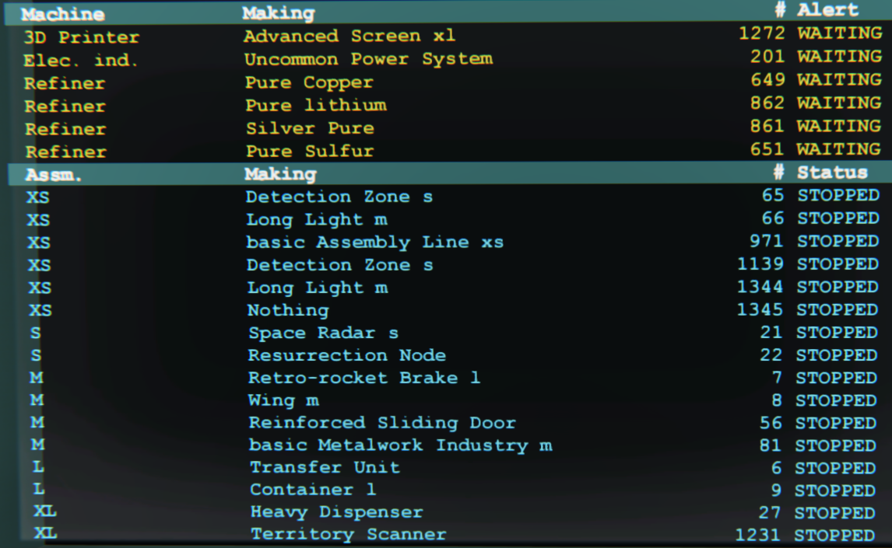

# InDUstrious
Screens for a Dual Universe Industrial Control Room, by Smacker: 
###### In game: Smacker, Discord: Smacker#5268
Discord Channel: https://discord.gg/Gw5HWJhXFR

 

### Quickstart
 * Rename your containers
 * Add a programming board and screens
 * Rename screens
 * Connect programming board to core and screens
 * Paste in programming board json
 
### Introduction
Screen based factory monitor, simulating a real control room
* Can monitor container contents if they have a single item
* Can designate containers as overflows
* Can monitor industry unit states and display any issues (like being jammed)
  * Will not clutter the display with units that are in a normal state (running, pending, stopped etc)
* Auto detects currently active Schematic
* Find function, will decorate clicked industry unit with arrows
* Container block displays can be configured in any order
* Supports US spellings

### Notes
* Industry units running normally are not shown
* Restart the master board if you rename anything
* Sometimes displays show as blank grey screens, restart the game to fix this (known NQ bug)
* Config links are to latest versions, for earlier versions see the releases
  * To install in game on a programming board: Right-click -> Advanced -> Paste Lua configuration from clipboard

Wiki has FAQ: https://github.com/SamMackrill/InDUstrious/wiki 

## In Game Setup
* Name the containers (including hubs) as C_XXXX where XXXX is the name of what is being stored e.g. C_Bauxite
  * If you have multiple containers and hubs with the same content then name them all the same
  * Case is significant (see below for handy table)
* Name the (optional) overflow containers (including hubs) as O_XXXX where XXXX is the name of what is being stored e.g. O_Hydrogen
* Some substance names cannot be matched exactly as NQ forbid certain characters in custom names (see below for list)
* Add large/medium screens, 2 x 2 layout of large screens seems to work well for medium factories
* Rename the screens (not the slots) exactly:
  * ContDisplay1, ContDisplay2, ContDisplay3 etc
  * ProdDisplay1, ProdDisplay2, ProdDisplay3 etc
  * You can have as many screeens as you have spare slots on the master board
  * To mirror a display connect a screen with the same name e.g. add another screen called ContDisplay1

### Installation
* Add a programming board
* Connect from the programming board to the core and screens (any order, do not rename any of the slots)
* Copy the [master_config.json](https://raw.githubusercontent.com/SamMackrill/InDUstrious/main/displaydriver/config/master_config.json) and paste it into the programming board
* A databank is optional and not used currently

### Find Feature
 * Click on an industry line to display floating arrows in your factory
 * Click again to hide them
 
 

### Container Block Display
 * Change the DisplayBlocks setting to control which blocks are shown and in which order
   * e.g. "pl al t3 t2 t1 ga"
     * t1-5 for TierX Ores and Pures
     * pl (plastics)
     * al (all alloys)
     * a1 (lower alloys)
     * a2 (higher alloys)
     * ga (gasses)
     * gl (glass)

### Upgrading from V1.x.x
* Remove all monitor programming boards, databanks and repeaters
   * All data is now obtained directly from the core
   * Use the [master_config.json](https://raw.githubusercontent.com/SamMackrill/InDUstrious/main/displaydriver/config/master_config.json) to update not just the start.lua

### Installation - Optional
* Tweak the behaviour by right clicking the master programming board -> Advanced -> Edit Lua Parameters

## Substance name list

_ | _ | _ | _ | _ | _ | _ | _
-- | -- | -- | -- | -- | -- | -- | --
Acanthite      | Advanced glass        | AgLi reinforced glass | AlFe      | AlLi        | Aluminium     | Bauxite        | Calcium
Carbon         | CaRefCu               | Chromite              | Chromium  | Coal        | Cobalt        | Cobaltite      | Columbite
Copper         | Cryolite              | CuAg                  | Duralumin | Fluorine    | Fluoropolymer | Garnierite     | Glass
Advanced glass | AgLi reinforced glass | Gold coated glass     | Gold      | GoldNuggets | Hematite      | Hydrogen       | Illmenite
Iron           | Kolbeckite            | Limestone             | Lithium   | Malachite   | Manganese     | Maraging steel | Natron
Nickel         | Niobium               | Oxygen                | Petalite  | Polycalcite | Polycarbonate | Polysulfide    | Pyrite
Quartz         | Red gold              | Rhodonite             | ScAl      | Scandium    | Silicon       | Silumin        | Silver
Sodium         | Stainless steel       | Steel                 | Sulfur    | Titanium    | Vanadinite    | Vanadium

## Credits
* badman74 for initial approach: https://github.com/badman74/DU
* DU Open Source Initiative
